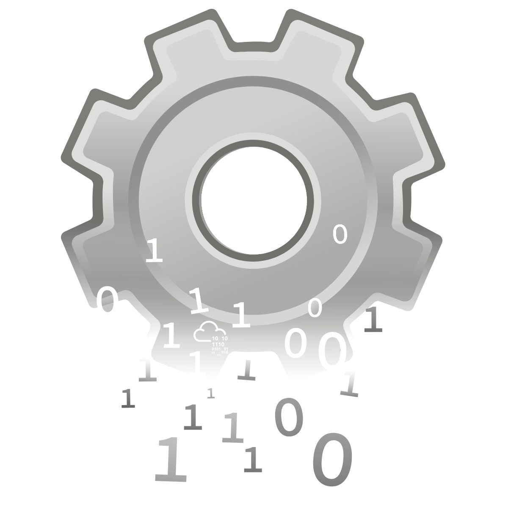
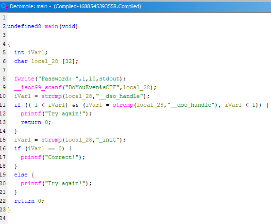

Strings can only help you so far.

> **Challenge Info**
> 
> Platform: TryHackMe
> 
> Category: Reverse Engineering
> 
> CTF Link: https://tryhackme.com/room/compiled
# Analysis
I open the provided binary using `strings Compiled-1688545393558.Compiled | less`.
A couple things catch my eye:
```
StringsIH
sForNoobH
Password:
DoYouEven%sCTF
__dso_handle
_init
Correct!
Try again!
```
We see a couple messages, and a few interesting strings, none of them are the password however.
# Reverse engineering
I open the binary in Ghidra to see what's going on:



I see what's the condition for the check to pass:
```C
  iVar1 = strcmp(local_28,"_init");
  if (iVar1 == 0) {
    printf("Correct!");
  }
```

I go back to the function that read user input:
```C
__isoc99_scanf("DoYouEven%sCTF",local_28);
```

From this, I conclude that the password must be `_init` written in the `DoYouEven%s` format.
```
~> ./Compiled-1688545393558.Compiled
Password: DoYouEven_init
Correct!⏎
```
