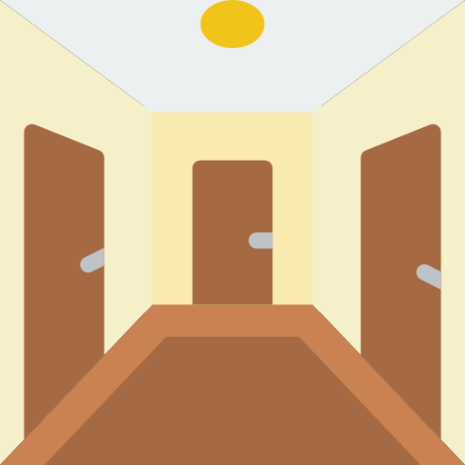
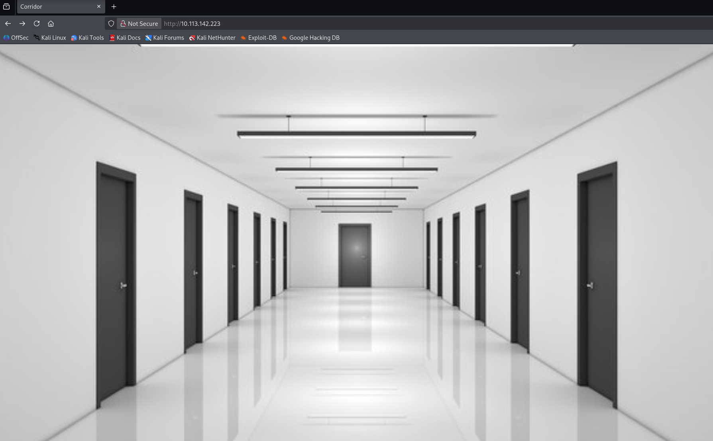
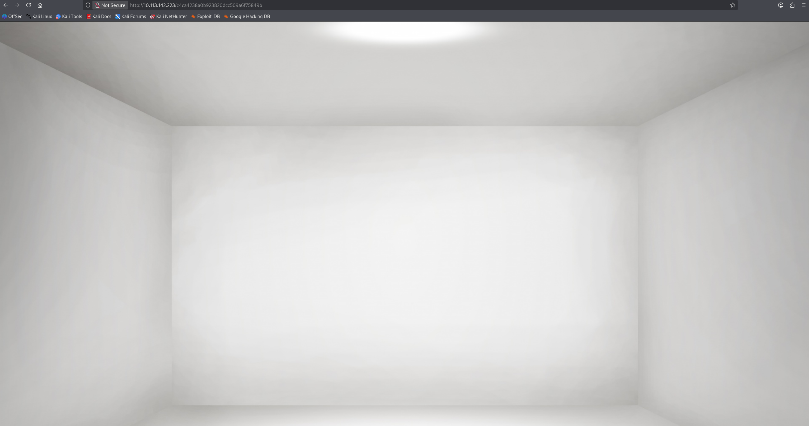
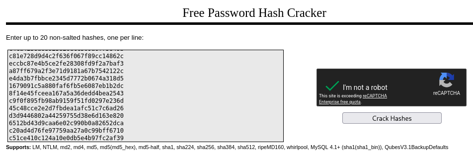
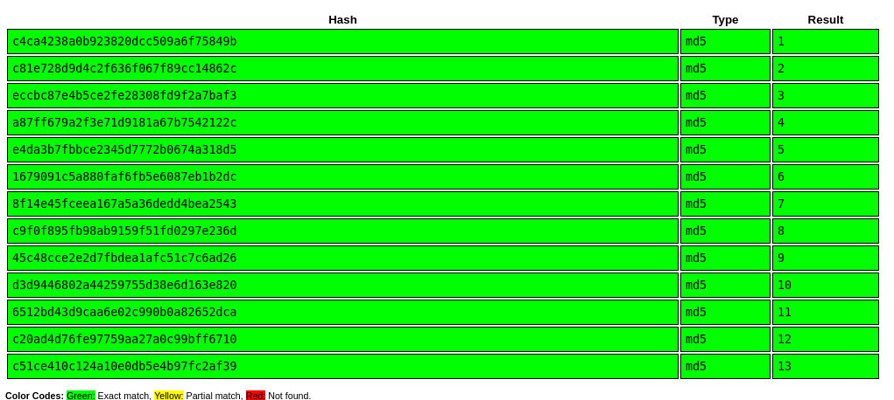
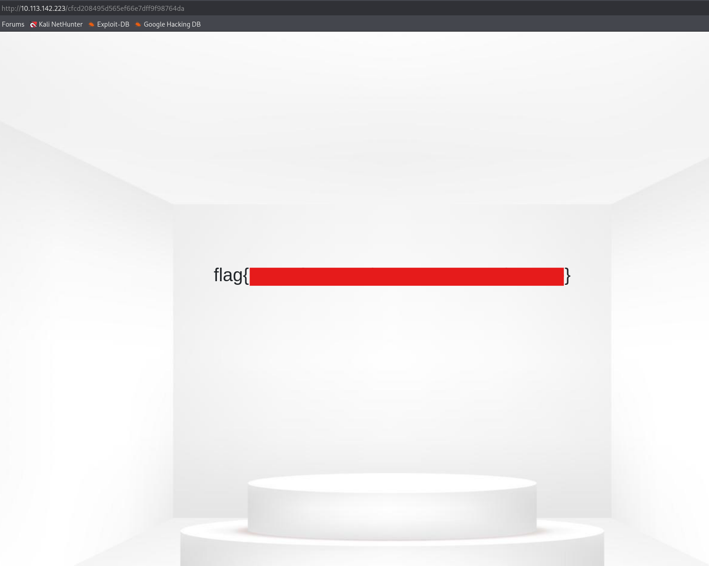

Can you escape the Corridor?


> **Challenge Info**
> 
> Platform: TryHackMe
> 
> Category: Web, Crypto
> 
> CTF Link: https://tryhackme.com/room/corridor

# Analysis
I visit the page provided in the challenge:


Clicking each door leads me to an empty room:


# Hashes
The URL of each room has it's own hash, I collect a hash from every room and take it to Crackstation:




Turns out it's just a number range, the flag probably lies just outside it. I use `echo` with the flag `-n` so the newline character doesn't get in the way of the hashing:
```
┌──(kali㉿kali)-[~]
└─$ echo -n "0" | md5sum
cfcd208495d565ef66e7dff9f98764da  -
```

