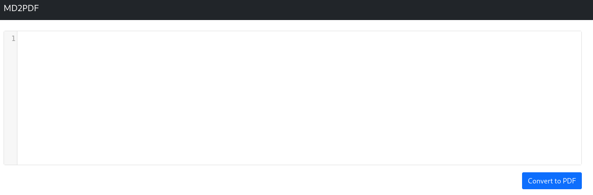
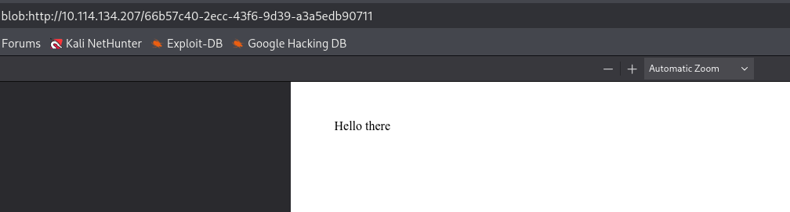
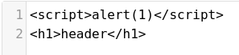
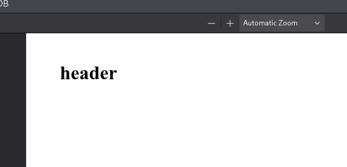
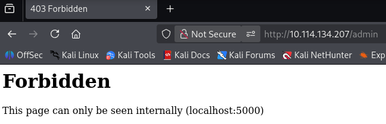
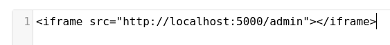
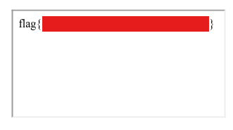

TopTierConversions LTD is proud to present its latest product launch.


> **Challenge Info**
> 
> Platform: TryHackMe
> 
> Category: Web
> 
> CTF Link: https://tryhackme.com/room/md2pdf

# Analysis
I visit the webpage provided in the challenge:



By converting a string a new tab opens up with a pdf in browser memory.


I check to see if injection is possible:





The JavaScript didn't trigger, but HTML injection worked just fine.


I decide to scan the site for some more info to see if I can do anything with the vulnerability:
```
┌──(kali㉿kali)-[~]
└─$ ffuf -u "http://10.114.134.207/FUZZ" -w /usr/share/wordlists/dirb/common.txt

        /'___\  /'___\           /'___\
       /\ \__/ /\ \__/  __  __  /\ \__/
       \ \ ,__\\ \ ,__\/\ \/\ \ \ \ ,__\
        \ \ \_/ \ \ \_/\ \ \_\ \ \ \ \_/
         \ \_\   \ \_\  \ \____/  \ \_\
          \/_/    \/_/   \/___/    \/_/

       v2.1.0-dev
________________________________________________

 :: Method           : GET
 :: URL              : http://10.114.134.207/FUZZ
 :: Wordlist         : FUZZ: /usr/share/wordlists/dirb/common.txt
 :: Follow redirects : false
 :: Calibration      : false
 :: Timeout          : 10
 :: Threads          : 40
 :: Matcher          : Response status: 200-299,301,302,307,401,403,405,500
________________________________________________

                        [Status: 200, Size: 2660, Words: 739, Lines: 102, Duration: 121ms]
admin                   [Status: 403, Size: 166, Words: 15, Lines: 5, Duration: 43ms]
:: Progress: [4614/4614] :: Job [1/1] :: 662 req/sec :: Duration: [0:00:08] :: Errors: 0 ::
```

I find an `admin` page but it is completely inaccessible to outsiders:


# Injection
To bypass this, I will have the server display the page for me with an `iframe`:



