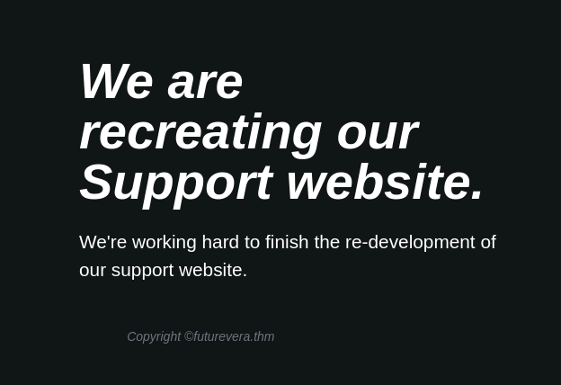
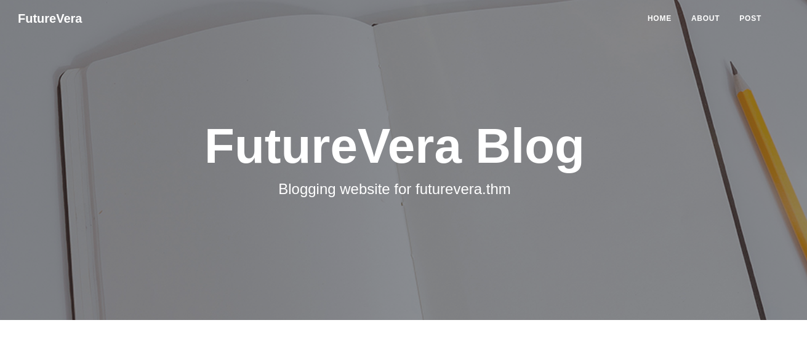
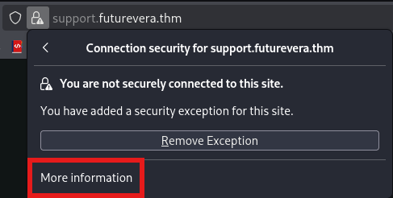
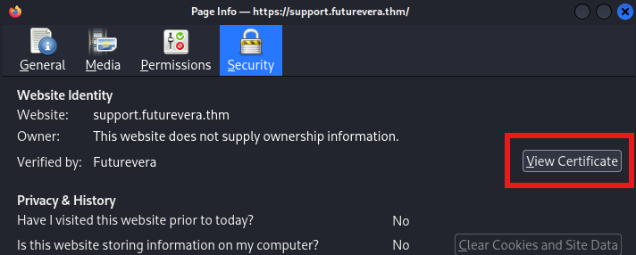
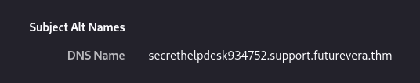
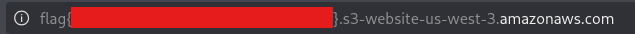

This challenge revolves around subdomain enumeration.


> **Challenge Info**
> 
> Platform: TryHackMe
> 
> Category: Web
> 
> CTF Link: https://tryhackme.com/room/takeover

# Recon
To begin I add the line `10.112.131.133 	futurevera.thm` to my `/etc/hosts` file.
After visiting the site in the browser I get greeted by this page:

There are no redirects or buttons to click though.
# Enumeration
The challenge description suggested subdomain enumeration, so I launch **ffuf** to see if I can find anything.
```

┌──(kali㉿kali)-[~]
└─$ ffuf -u https://10.112.131.133 -H "Host: FUZZ.futurevera.thm" -w /usr/share/wordlists/dirb/common.txt -fs 4605

        /'___\  /'___\           /'___\
        /\ \__/ /\ \__/  __  __  /\ \__/
        \ \ ,__\\ \ ,__\/\ \/\ \ \ \ ,__\
        \ \ \_/ \ \ \_/\ \ \_\ \ \ \ \_/
         \ \_\   \ \_\  \ \____/  \ \_\
          \/_/    \/_/   \/___/    \/_/

       v2.1.0-dev
________________________________________________

 :: Method           : GET
 :: URL              : https://10.112.131.133
 :: Wordlist         : FUZZ: /usr/share/wordlists/dirb/common.txt
 :: Header           : Host: FUZZ.futurevera.thm
 :: Follow redirects : false
 :: Calibration      : false
 :: Timeout          : 10
 :: Threads          : 40
 :: Matcher          : Response status: 200-299,301,302,307,401,403,405,500
 :: Filter           : Response size: 4605
________________________________________________

blog                    [Status: 200, Size: 3838, Words: 1326, Lines: 81, Duration: 40ms]
Blog                    [Status: 200, Size: 3838, Words: 1326, Lines: 81, Duration: 44ms]
support                 [Status: 200, Size: 1522, Words: 367, Lines: 34, Duration: 42ms]
Support                 [Status: 200, Size: 1522, Words: 367, Lines: 34, Duration: 41ms]
:: Progress: [4614/4614] :: Job [1/1] :: 925 req/sec :: Duration: [0:00:07] :: Errors: 0 ::
```
I found 2 subdomains, `blog` and `support`. Let's add those to the `/etc/hosts` file:
`10.112.131.133 	futurevera.thm support.futurevera.thm blog.futurevera.thm`

I visit the 2 sites starting with support:



And blog:



After poking around a bit I find my next hint in the certificate:





I add the new domain to my `/etc/hosts` file:
`10.112.131.133 	futurevera.thm support.futurevera.thm blog.futurevera.thm secrethelpdesk934752.support.futurevera.thm`

After visiting `http://secrethelpdesk934752.support.futurevera.thm` the flag appears in the URL:

