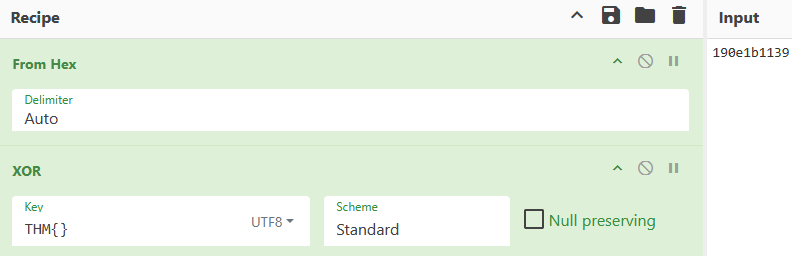
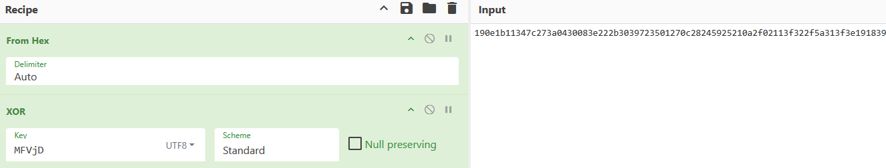

A w1se guy 0nce said, the answer is usually as plain as day.


> **Challenge Info**
> 
> Platform: TryHackMe
> 
> Category: Crypto
> 
> CTF Link: https://tryhackme.com/room/w1seguy

# Analysis
We connect to the lab machine with ncat:

```
┌──(kali㉿kali)-[~]
└─$ ncat 10.112.177.209 1337
This XOR encoded text has flag 1: 190e1b11347c273a0430083e222b3039723501270c28245925210a2f02113f322f5a313f3e191839
What is the encryption key? 
```

Let's take a look at the source code provided in the challenge:
```python
import random
import socketserver
import socket, os
import string

flag = open('flag.txt','r').read().strip()

def send_message(server, message):
    enc = message.encode()
    server.send(enc)

def setup(server, key):
    flag = 'THM{thisisafakeflag}'
    xored = ""
    for i in range(0,len(flag)):
        xored += chr(ord(flag[i]) ^ ord(key[i%len(key)]))
    hex_encoded = xored.encode().hex()
    return hex_encoded

def start(server):
    res = ''.join(random.choices(string.ascii_letters + string.digits, k=5))
    key = str(res)
    hex_encoded = setup(server, key)
    send_message(server, "This XOR encoded text has flag 1: " + hex_encoded + "\n")
    send_message(server,"What is the encryption key? ")
    key_answer = server.recv(4096).decode().strip()
    try:
        if key_answer == key:
            send_message(server, "Congrats! That is the correct key! Here is flag 2: " + flag + "\n")
            server.close()
        else:
            send_message(server, 'Close but no cigar' + "\n")
            server.close()
    except:
        send_message(server, "Something went wrong. Please try again. :)\n")
        server.close()
        
class RequestHandler(socketserver.BaseRequestHandler):
    def handle(self):
        start(self.request)

if __name__ == '__main__':
    socketserver.ThreadingTCPServer.allow_reuse_address = True
    server = socketserver.ThreadingTCPServer(('0.0.0.0', 1337), RequestHandler)
    server.serve_forever()
```

In the `start` function we see:
```python
res = ''.join(random.choices(string.ascii_letters + string.digits, k=5))
key = str(res)
hex_encoded = setup(server, key)
```
This tells me the key used for encryption is 5 symbols long.

Let's see how the `setup` function uses this key:
```python
def setup(server, key):
    flag = 'THM{thisisafakeflag}'
    xored = ""
    for i in range(0,len(flag)):
        xored += chr(ord(flag[i]) ^ ord(key[i%len(key)]))
    hex_encoded = xored.encode().hex()
    return hex_encoded
```
Every char in the flag gets XOR'ed, the resulting string gets turned into bytes and hex numbers.
# Decryption
Since we know that the first 4 letters of the flag are `THM{` and the last is `}`. We can XOR the first 4 and last bytes of the hex encoded flag to retrieve the key.

From the hex: 
```
190e1b11347c273a0430083e222b3039723501270c28245925210a2f02113f322f5a313f3e191839
^^^^^^^^                                                                      ^^
```
I copy just `190e1b1139` and XOR it with `THM{}` in CyberChef:


And the output is `MFVjD`.

I feed this key back into CyberChef this time using the whole encoded flag as input:


And the output is `THM{*}`. That's our first flag.

To get the second flag I put the key into the program:
```
What is the encryption key? MFVjD
Congrats! That is the correct key! Here is flag 2: THM{*}
```
